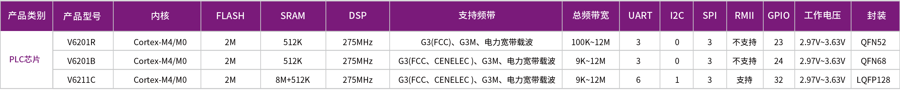

# [V6211](https://doc.soc.xin/V6211)

* [Vango](http://www.vangotech.com): [Cortex-M4 + M0](https://github.com/SoCXin/Cortex)
* [L1R3](https://github.com/SoCXin/Level): 26 MHz

## [简介](https://github.com/SoCXin/V6211/wiki)

[V6211](http://www.vangotech.com/pd.php?id=17&types=3) 系列是兼容G3-PLC/HPLC的多频段载波芯片。集成了一个Cortex-M4内核，一个Cortex-M0内核，一个高性能DSP，六个UART接口，一个SPI Master/Slave 接口，一个SPI Master接口，一个SPI Slave接口，一个I2C接口，一个支持10Mbps RMII以太网路接口，以及核心PLC MAC/PHY层功能和模拟前端。同时支持扩展高达8M字节SDRAM。 搭配万高的线路驱动器芯片（V6100D），形成了一个完整的通信调制解调器解决方案。除了可支持宽带与窄带PLC标准外，也支持万高制定的新一代电力线通信标准，具备完整的宽带支持方案。

### 关键参数

* Cortex-M4 + Cortex-M0
* 2MB Flash + 512KB SRAM + SDRAM
* 支持频带：G3-FCC、G3-CENELEC A、G3M、电力宽带载波，总频带宽度9KHz~12MHz
* 集成Ethernet RMII接口，支持高速的总线接口
* 支持多种调制方式：OFDM，DBPSK/BPSK，DQPSK/QPSK，D8PSK/8PSK，16QAM
* 底层PHY采用DSP，提升效率，在MAC层采用SoC架构，易于维护与修正
* 提供最高256/512/1024/2048点FFT/IFFT加速器
* 支持128/192/256位AES编解码器
* 设计与改善陷波滤波器(Notch filter)，加强定位干扰频率的定点精准度
* 消除三个干扰频率
* 优化设计前导信号检测（Preamble Detection)机制，采用例外排除检测机制（Exclusive Detection）来达到鲁棒检测的目的
* 大幅改善解调信号物理层算法
* 支持三相过零点检测，提供更精确的相位识别
* 集成三组DMA
* 最多6个UART

## [资源收录](https://github.com/SoCXin)

* [参考资源](src/)
* [参考文档](docs/)
* [参考工程](project/)

## [选型建议](https://github.com/SoCXin/V6211)

[V6211](https://github.com/SoCXin/V6211)主要应用于智能电网通信、高级计量基础设施（AMI)、智能表计、电力线通信数据集中器、光伏、路灯控制、智能家居、电梯控制等领域。

- V6211主端芯片，应用于网关模块
- V6201从端芯片，应用于终端模块

## [www.SoC.xin](http://www.SoC.Xin)
